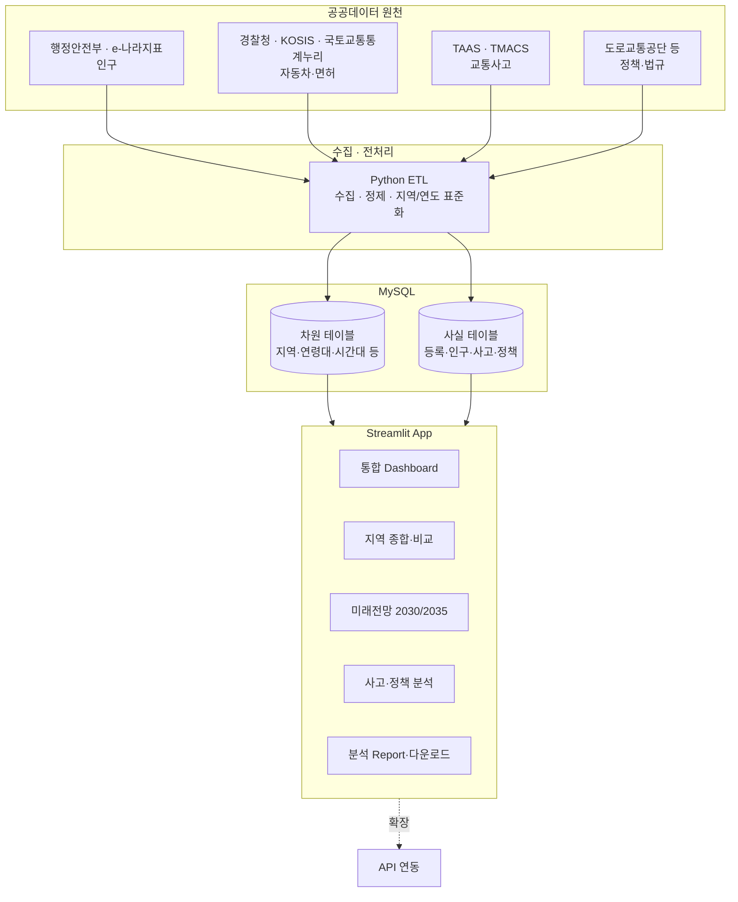

# SKN36-1st-3team

# 🚗 SAFE
### 전국 자동차 등록·고령화·교통사고 통합 분석 및 미래전망 시스템

**자동차 등록, 고령화, 교통사고, 운전면허 정책을 한 곳에서 — 정부·지자체를 위한 지역 교통정책 데이터 분석 서비스**


> 📽️ **핵심 흐름 시연 GIF/스크린샷 삽입 예정** `지역 선택 → 자동차 등록·고령화·사고 통합 조회 → 지역 비교 → 미래전망(2035) → 보고서 다운로드`

---

## 📑 목차

1. [팀 소개](#-팀-소개)
2. [프로젝트 개요](#-프로젝트-개요)
3. [개발 배경 & 문제의식](#-개발-배경--문제의식)
4. [핵심 기능](#-핵심-기능)
5. [기술 스택](#-기술-스택)
6. [시스템 아키텍처](#-시스템-아키텍처)
7. [데이터 설계](#-데이터-설계)
8. [화면 구성](#-화면-구성)
9. [프로젝트 구조](#-프로젝트-구조)
10. [실행 방법](#-실행-방법)
11. [제약사항](#-제약사항)
12. [향후 계획](#-향후-계획)

---

## 👥 팀 소개

**SKN36기 3팀**

| 프로필 | 이름 | 역할 | 담당 | GitHub |
|---|---|---|---|---|
| | 안효원 | 데이터 정의 · 데이터수집/분석 | 데이터 정의서 작성, 자동차·인구·사고·정책 원천 데이터 수집·전처리 | |
| | 김재훈 | 기획/요구사항 | 시장조사·Pain Point·요구사항정의서 작성 및 관리 | |
| | 신지수 | DB/개발 | MySQL·ERD 설계, 조회 쿼리·데이터 결합 로직 구현 | |
| | 이유나 | UI/API | Streamlit 대시보드·시각화·보고서, 향후 API 구조 설계 | |

> 팀원 프로필·GitHub 링크는 추후 채워주세요.

---

## 📌 프로젝트 개요

**SAFE(Safe-driving Analytics & Forecasting Engine)**는 서로 다른 기관에 흩어진 자동차 등록·인구/고령화·교통사고·운전면허 정책 데이터를 지역 단위로 통합해, 정부·지자체가 현재와 미래(2030·2035)의 지역 교통환경을 한눈에 조회·비교할 수 있게 하는 데이터 분석 시스템입니다.

- **프로젝트명** : 전국 자동차 등록·고령화·교통사고 통합 분석 및 미래전망 시스템 (SAFE)
- **작성일 / 버전** : 2026.08.20 / v1.2
- **한 줄 소개** : 자동차 등록부터 고령운전자 사고·면허반납 정책까지, 지역 기준으로 통합 조회하는 정부·지자체용 분석 SaaS

```
[자동차 등록 현황] + [인구·고령화 + 2030/2035 장래인구] + [고령운전자 교통사고] + [면허 자진반납·정책]
                                   │
                          지역 · 연도 기준 통합
                                   │
              통합 Dashboard → 지역 간 비교 → 분석 Report/다운로드 → (확장) API 연동
```

---

## 🧭 개발 배경 & 문제의식

### 왜 필요한가

- **데이터의 분산** — 자동차 등록·인구·고령화·교통사고·운전면허·정책 데이터가 서로 다른 기관·시스템(공공데이터포털, KOSIS, TAAS, 경찰청 등)에 흩어져 있어, 지역 단위 종합 분석을 하려면 매번 별도의 수집·가공·비교 작업이 필요합니다.
- **현재만 보는 한계** — 현재 현황만으로는 향후 자동차·교통정책 수요를 선제적으로 판단하기 어려워, 2030·2035 장래인구 전망까지 함께 볼 필요가 있습니다.
- **정책 효과 판단의 어려움** — 고령운전자 면허 자진반납 지원정책이 실제로 사고 감소에 기여했는지, 여러 지자체 자료에 흩어진 정책 정보만으로는 비교·판단이 쉽지 않습니다.

### 접근 방법

공공데이터·공식 통계를 수집·정제해 **MySQL**에 저장하고, **Python(Streamlit)** 기반 통합 대시보드·지역 비교·미래전망·보고서 기능을 제공합니다. 향후 **API**를 통한 정부·지자체 내부 시스템 연동까지 확장 가능한 구조로 설계합니다.

> 미래 사고건수를 단순히 예측하지 않고, 공식 장래인구 추계와 현재 지표를 함께 제시해 정책 관심지역을 파악하도록 돕습니다. 정책 시행 전후 비교 역시 상관관계로 제공하며 인과관계로 단정하지 않습니다.

---

## 🎯 핵심 기능

| 기능 | 설명 | 관련 요구사항 |
|---|---|---|
| 🚗 **자동차 등록 현황 조회·시각화** | 지역·연도·차종·신규/말소 조건으로 등록 현황을 조회·비교하고 그래프로 시각화 | RF-1.0 |
| 👴 **고령화·미래전망·지역 종합분석** | 총인구·65세 이상 인구·고령화율·고령운전자 수를 2030·2035 장래인구와 함께 지역 단위로 통합 조회 | RF-2.0 |
| 🚨 **고령운전자 교통사고 분석** | 지역·연도별 사고건수·사고유형·심각도를 등록대수·고령운전자 수 대비로 비교 | RF-3.0 |
| 📋 **면허 자진반납·정책 분석** | 지역별 자진반납 인원·반납률과 지원정책을 조회하고, 정책 시행 전후 사고 변화를 비교 | RF-4.0 |
| 📊 **통합 Dashboard·Report** | 지역별 등록·고령화·사고·미래전망·면허반납 지표를 한 화면에서 조회, 보고서·데이터 다운로드 제공 | RF-5.0 |
| 🔗 **API 연동** *(확장)* | 정부·지자체 내부 시스템에서 활용할 수 있는 API 제공 | RF-5.3 (Optional) |
| 💬 **기업 FAQ / 자연어 FAQ** *(후순위)* | 자동차 기업 FAQ 검색 및 LLM 기반 자연어 질의 | RF-6.0 / RF-7.0 (후순위·Optional) |

---

## 🛠 기술 스택

| 구분 | 기술 |
|---|---|
| **Data / DB** |   |
| **App** |   |
| **Infra / 협업** |   |
| **데이터 출처** | 공공데이터포털, KOSIS(국가통계포털), TAAS·TMACS(도로교통공단), 경찰청, 국토교통통계누리, 행정안전부 |

> 시각화 라이브러리(Plotly/Matplotlib 등)와 배포 환경은 확정되는 대로 채워주세요.

---

## 🏗 시스템 아키텍처



---

## 🗄 데이터 설계

### 데이터 카테고리

| 카테고리 | 내용 | 대응 ERD 테이블 |
|---|---|---|
| 인구 | 지역별 인구·세대·성별 현황 | FACT_POPULATION |
| 자동차 | 등록 현황, 운전면허 소지자·자진반납 현황 | FACT_VEHICLE_REGISTRATION, FACT_LICENSE_HOLDER, FACT_LICENSE_SURRENDER |
| 교통사고 | 연령·지역·시간대·기상·사고유형별 사고 데이터 | FACT_TRAFFIC_ACCIDENT, FACT_ACCIDENT_INDEX |
| 교통법규·정책 | 고령운전자 교육예약, 전국/지역 정책, 자진반납 지원 | SAFETY_EDUCATION_RESERVATION, POLICY_NATIONAL, POLICY_REGIONAL, POLICY_LICENSE_SURRENDER_SUPPORT |
| FAQ | 자동차 기업 FAQ *(항목 정의 예정)* | — |

### ERD 설계 방향

지역·연령대·시간대 등 여러 원천 데이터에서 공통으로 쓰이는 축은 **차원(Dimension) 테이블**로 분리하고, 실제 수치는 **사실(Fact) 테이블**에서 차원을 참조하는 스타 스키마로 설계했습니다. 상세 ERD는 `docs/erd/` 참고.

> FAQ 데이터는 아직 실제 항목이 정의되지 않아 이번 ERD·기능 범위(MVP)에서는 제외했습니다.

---

## 🖥 화면 구성

| 화면 | 설명 |
|---|---|
| 통합 Dashboard | 지역별 등록·고령화·사고·미래전망·면허반납 지표 요약 |
| 자동차 등록 현황 | 지역·연도·차종·신규/말소 조건별 조회·그래프 |
| 지역 종합·비교 | 선택 지역의 통합 지표를 전국 평균/타 지역과 비교 |
| 미래전망 | 현재 ↔ 2030·2035 고령화·인구 변화 시각화 |
| 교통사고 분석 | 사고유형·심각도별 조회, 등록대수·고령운전자 수 대비 비교 |
| 면허 자진반납·정책 | 지역별 반납 현황, 정책 시행 전후 사고 변화 비교 |
| 분석 Report | 선택 지역·기간 보고서/데이터 다운로드 |

---

## 🗂 프로젝트 구조

```
root/
├─ data/
│  ├─ raw/            (원본 공공데이터: 인구·자동차·사고·정책)
│  └─ processed/       (전처리·표준화된 데이터)
├─ etl/                (수집·전처리·MySQL 적재 스크립트)
├─ db/
│  ├─ erd/             (ERD 설계 파일)
│  └─ sql/             (DDL, 마이그레이션)
├─ app/                (Streamlit 애플리케이션)
│  ├─ pages/           (기능별 화면: 등록현황/지역종합/사고분석/정책분석/리포트)
│  └─ components/      (공용 차트·필터 컴포넌트)
├─ docs/
│  ├─ requirements/    (요구사항정의서)
│  ├─ data_dictionary/ (데이터 정의서)
│  └─ meeting_notes/   (회의록)
├─ tests/
├─ requirements.txt
└─ README.md
```

---

## 🚀 실행 방법

```bash
# 1. 가상환경 및 의존성 설치
python -m venv venv
source venv/bin/activate      # Windows: venv\Scripts\activate
pip install -r requirements.txt

# 2. 환경 변수 설정 (.env.sample 복사 후 MySQL 접속정보 입력)
cp .env.sample .env

# 3. MySQL 데이터 적재
python etl/load_all.py

# 4. Streamlit 앱 실행
streamlit run app/main.py
```

> 실제 스크립트/파일명은 개발 진행에 맞춰 업데이트해주세요.

---

## ⚠️ 제약사항

| 구분 | 내용 | 대응 방안 |
|---|---|---|
| 데이터 | 제공 항목·기간·갱신주기가 제공기관 정책에 의존 | 확보 가능 범위로 조회·분석 기준 확정 |
| 데이터 품질 | 결측값·중복값·지역명/연도 형식 불일치 가능 | 수집 후 검증 및 지역·연도 기준 표준화 |
| 미래 전망 | 장래인구는 공식 추계값, 고령화만으로 미래 사고 직접 예측 불가 | 관측값/추계값 구분 표시, 변화 가능성 중심 제시 |
| 분석 해석 | 정책 전후 변화를 정책만의 효과로 단정 불가 | 상관관계만 제공, 분석 한계 명시 |
| 보안 | API 키·DB 비밀번호 노출 위험 | 환경변수/Secrets, .gitignore, 민감정보 커밋 금지 |

---

## 🌱 향후 계획

- MVP 핵심(자동차 등록·고령화/미래전망·사고·지역 종합분석) 우선 구현, API·기업 FAQ·Groq 기반 FAQ는 단계적 적용
- 원천 데이터 수집·정제 완료 후 ERD 확정 및 MySQL 스키마 구축
- Streamlit 통합 Dashboard·지역 비교·보고서 기능 구현
- 정부·지자체 사용자 대상 시범 피드백 반영