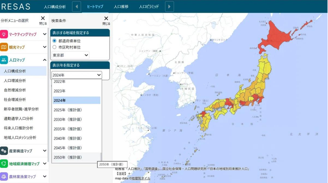
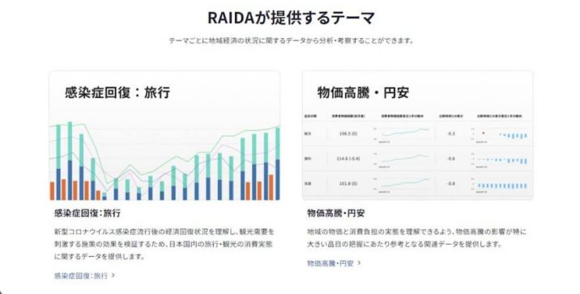
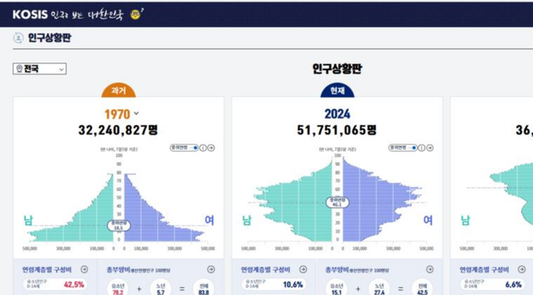
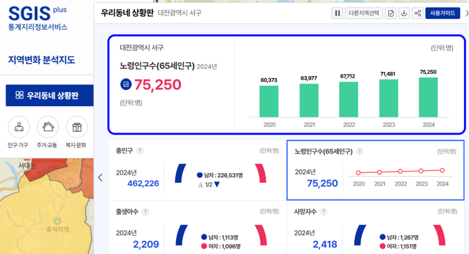
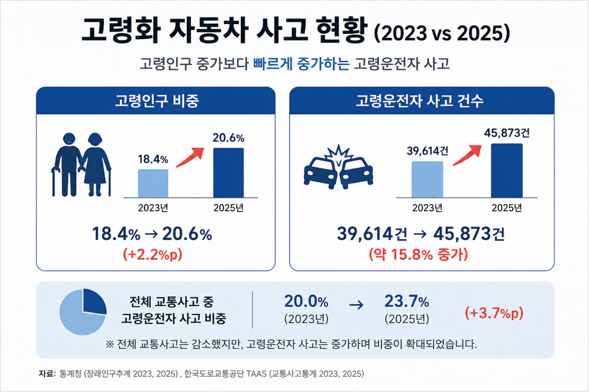
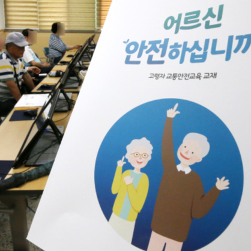
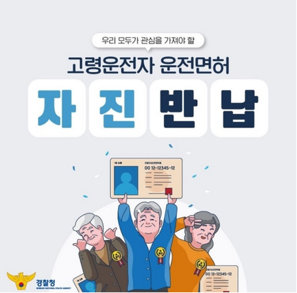
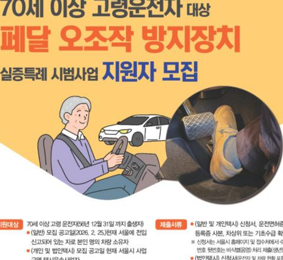
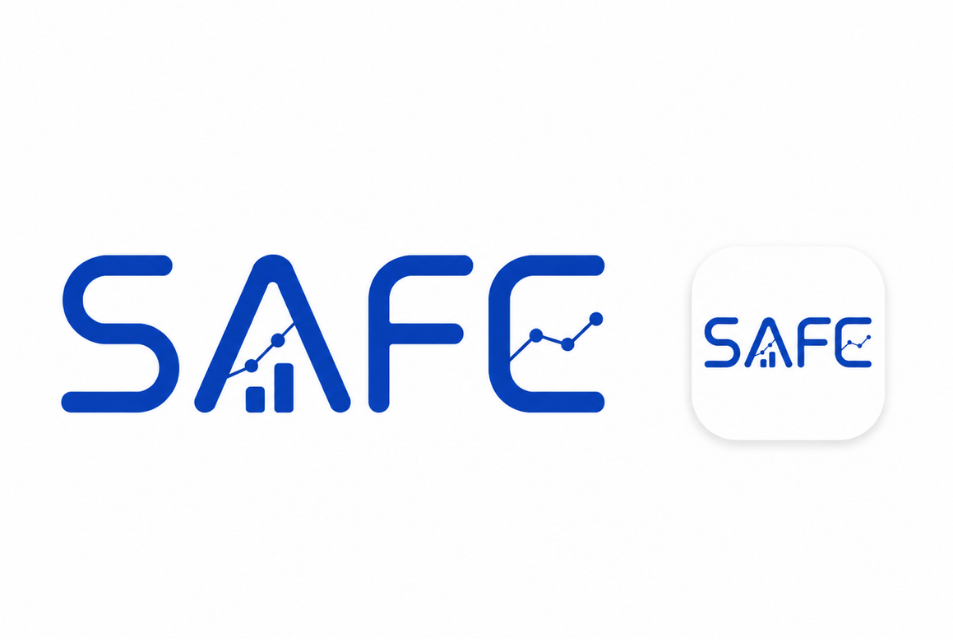

<!-- _class: cover -->

SKN36 · 1st Project · TEAM 3

# SAFE

Safe-driving Analytics & Forecasting Engine

고령운전자 교통사고 데이터 분석 및 미래 전망 서비스

안효원 · 신지수 · 이유나 · 김재훈

---

<!-- 2. 고령화 -->

# 고령화

> **65세 이상 인구 비율**을 고령화 관련 사회 지표의 기준으로 삼고 있습니다.  
> 재정경제부

---

# 일본의 고령화 데이터 플랫폼

| **RESAS** | **RAIDA** |
| :---: | :---: |
|  |  |
| **RESAS 지역경제분석시스템** | **RAIDA 정부 데이터 플랫폼** |

---

# 대한민국의 고령화 데이터 플랫폼

| **KOSIS** | **SGIS** |
| :---: | :---: |
|  |  |
| **KOSIS 국가통계포털** | **SGIS 통계지리정보서비스** |

---

<!-- 5. 고령화 자동차 사고 -->

# 고령화 자동차 사고

---

<!-- 6. 사고 현황 -->

# 고령화 자동차 사고 현황

## 2023 vs 2025

고령인구 증가보다 **빠르게 증가하는 고령운전자 사고**

---

<!-- 7. 정책 -->

# 현재 고령운전자 사고,

# 어떻게 관리되고 있는가?

---

<!-- 8. 정책 3가지 -->

# 현재 시행 중인 고령운전자 관련 정책

| **운전면허 관리와 교육** | **운전면허 자진반납 지원** | **차량 안전장치 지원** |
| :---: | :---: | :---: |
|  |  |  |
| **운전면허 관리와 교육** | **운전면허 자진반납 지원** | **차량 안전장치 지원** |

---

<!-- 9. SAFE -->

# SAFE

**공공데이터 수집 → 전처리 → MySQL 적재 → 분석 → 시각화 → 미래 전망**

- 인구 · 자동차 · 교통사고 · 제도 · FAQ, 5개 영역 데이터 통합
- 단순 통계 대시보드가 아니라, 현황 파악 → 추세 분석 → 미래 전망 → 정책 대응까지 이어지는 데이터 파이프라인
- 핵심 사용자: 지자체 교통정책 담당자 / 교통안전 담당자

---

# 기존 플랫폼과 무엇이 다를까?

TAAS

교통사고 중심

사고 · 시간 · 지역

교통사고 발생 현황을 
조건별로 조회·분석

VS

SAFE

고령운전자 중심

인구 · 면허 · 자동차 
사고 · 정책 · 미래

흩어진 공공데이터를 통합해 
하나의 관점으로 연결

→

단순 사고 조회를 넘어
<strong>현황 → 추세 → 미래 전망 → 정책 대응</strong>까지 연결

---

# 전체 시스템 아키텍처

| **① 공공데이터 수집** | **② 원본 데이터** | **③ 데이터 전처리** |
| :---: | :---: | :---: |
| TAAS · KOSIS · 행안부 · 경찰청 · 국토부 | Excel · CSV | pandas |
| 공공기관 데이터 수집 | 원본 파일 저장 | 정제 · 표준화 · 구조 변환 |

| **④ 데이터베이스** | **⑤ 데이터 분석** | **⑥ 데이터 시각화** |
| :---: | :---: | :---: |
| MySQL | pandas · NumPy | Streamlit · Plotly |
| SQLAlchemy · PyMySQL | 집계 · 지표 계산 | 대시보드 구현 |

### 🚗 **⑦ SAFE 서비스**

> **인구 · 자동차 · 교통사고 · 제도 · FAQ · 미래전망**

---

# 데이터 수집 — 설계 순서

서비스 메뉴부터 먼저 정의하고, 필요한 데이터를 역으로 선별했습니다.

**서비스 메뉴 정의 → 분석 목적 설정 → 필요 데이터 선정 → 공공데이터 수집**

| **메뉴** | **핵심 목적** |
| :---: | :---: |
| 인구 | 지역별 인구·고령화 현황 |
| 자동차 | 등록 현황 · 운전면허 · 자진반납 |
| 교통사고 | 연령·시간대·기상·지역별 사고 |
| 제도 | 고령운전자 정책 비교 |
| FAQ | 교통안전 관련 정보 조회 |

---

# 데이터 출처

- **인구**: e-나라지표, 행정안전부
- **자동차 · 면허**: 국토교통부, 국토교통통계누리, KOSIS, 경찰청
- **교통사고**: TAAS 교통사고분석시스템
- **제도**: 도로교통공단, 지역별 정책 자료
- **FAQ**: 고령운전자·교통안전 관련 FAQ 자료

> 기관마다 형식이 다른 원본 데이터를 **표준화된 분석 기준**으로 정리하는 것이 핵심 과제였습니다.

---

# 데이터 전처리 파이프라인

| **① 원본 확인** | **② 데이터 정제** | **③ 데이터 표준화** | **④ 구조 변환** | **⑤ 정보 추출** |
| :---: | :---: | :---: | :---: | :---: |
| Excel · CSV | 결측치 · 병합 셀 처리 | 컬럼명 · 문자열 정리 | Wide → Long | 연도 · 지역 · 연령 · 시간대 |
| 헤더 구조 확인 | 합계 · 불필요 행 제거 | 분석 기준 통일 | `melt()` 활용 | 필요한 분석 기준 추출 |

 

| **⑥ 자료형 변환** | **⑦ 데이터 재구성** | **⑧ 결과 검증** | **⑨ DB 적재 준비** |
| :---: | :---: | :---: | :---: |
| 문자 → 숫자 | Pivot · 파생지표 생성 | 행 · 컬럼 · 결측치 확인 | 적재 컬럼 최종 선택 |
| 날짜 형식 변환 | 분석 가능한 형태로 변환 | 전처리 결과 검증 | 표준화된 데이터 생성 |

### 🎯 공통 전처리 기준

> **지역 · 연도 · 연령 · 시간대**

---

# DB 설계 — SQLite → MySQL 전환

| **구분** | **초기 (SQLite)** | **전환 후 (MySQL)** |
| :---: | :---: | :---: |
| 목적 | 빠른 기능 구현·테스트 | 분석 데이터 통합 관리 |
| 연결 | .db 파일 직접 연결 | SQLAlchemy + PyMySQL |
| 관리 단위 | 파일 단위 | 테이블 단위 통합 관리 |
| 확장성 | 소규모 프로토타입용 | 데이터·테이블 확장에 유리 |

데이터·분석 테이블이 늘어나고 여러 페이지에서 같은 데이터를 조회하게 되면서 체계적 관리를 위해 MySQL로 전환했습니다.

---

# DB 적재 구조

| **① 함수·테이블 매핑** | **② 테이블 생성 확인** | **③ 기존 데이터 초기화** | **④ 데이터 적재** | **⑤ 적재 결과 검증** |
| :---: | :---: | :---: | :---: | :---: |
| 전처리 함수 ↔ 테이블명 | 테이블 존재 여부 확인 | 기존 데이터 제거 | DataFrame → MySQL | 행 · 컬럼 수 확인 |
| 적재 대상 자동 연결 | `CREATE TABLE IF NOT EXISTS` | `TRUNCATE` | `to_sql()` · `chunksize=1000` | 오류 로그 확인 |

### 🎯 DB 적재 핵심

> **전처리 완료 → 테이블 연결 → 초기화 → 일괄 적재 → 결과 검증**

대표 테이블: `accident_age`, `accident_region`, `driver_age_accident`, `education_reservation`, `old_driver_policy` 등

전처리 함수 ↔ 테이블 매핑 구조라서 새 데이터 추가 시 매핑만 추가하면 재사용 가능

---

## 📂 프로젝트 폴더 구조

| **원본 데이터** | **데이터 전처리** | **DB 적재** | **데이터 조회** |
| :---: | :---: | :---: | :---: |
| `data/` | `analyze/` | `database/` | `data_repository/` |
| FAQ · 인구 · 자동차 교통사고 · 제도 | 데이터 정제 · 변환 분석용 구조 생성 | MySQL 연결 전처리 데이터 적재 | DB 데이터 조회 화면에 데이터 전달 |

 

| **분석 · 예측** | **웹 서비스** | **프로젝트 문서** | **환경 설정** |
| :---: | :---: | :---: | :---: |
| `models/` | `streamlit/` | `docs/` | `.env` · `.gitignore` |
| 시계열 분석 시각화 공통 기능 | 페이지 · 메뉴 구성 Streamlit 서비스 | 발표자료 · 문서 프로젝트 기록 | DB 접속정보 관리 보안 파일 제외 |

### 🎯 코드 구성 흐름

> **원본 데이터 → 전처리 → DB 적재 → 데이터 조회 → 분석·예측 → 웹 서비스**

---

# 웹 서비스 구현 흐름

| **① 사용자 조건 선택** | **② 데이터 조회 요청** | **③ DB 데이터 조회** | **④ 데이터 분석** | **⑤ 결과 시각화** |
| :---: | :---: | :---: | :---: | :---: |
| 지역 · 연도 · 연령 등 | Streamlit 페이지 | MySQL → DataFrame | 필터링 · 집계 | Plotly 시각화 |
| 분석 조건 설정 | SQL Query 실행 | pandas로 데이터 조회 | 파생지표 계산 | 분석 결과 출력 |

### 🎯 웹 서비스 핵심

> **조건 선택 → 데이터 조회 → 분석 → 시각화 → 사용자에게 결과 제공**

기능별 화면: 인구 · 자동차 · 교통사고 · 제도 · FAQ · 미래전망 (총 6개 메뉴)

---

# 시각화 기법 선택 기준

| **기법** | **활용 목적** |
| :---: | :---: |
| KPI Metric | 전체 영역 핵심 수치 즉시 확인 |
| Line Chart | 인구·자동차·사고 연도·월별 추세 |
| Bar Chart | 지역·연령 비교 규모·순위 비교 |
| Heatmap | 시간대·월별 사고 집중 시점 파악 |
| Choropleth Map | 지역별 사고 공간적 비교 |

> 한 가지 차트를 반복하지 않고, 데이터 특성에 맞는 시각화를 선택했습니다.

---

# SAFE 데이터 분석 기법 및 예측 모델 정리

- 전체 분석 흐름
- 예측 모델 검토 및 최종 선정 과정
- 데이터별 적용 기법 및 모델
- 분석 시 주의사항

---

## 전체 분석 흐름 (설계 단계)

| **① 지역별 현황 비교** | **② 연도별 추세 분석** | **③ 증감 방향 확인** |
| :---: | :---: | :---: |
| 지역별 사고 현황 비교 | 연도별 사고 변화 확인 | 선형회귀 적용 |
| 사고 규모 및 지역 차이 파악 | 증가 · 감소 추세 분석 | 추세의 방향성 확인 |

 

| **④ 예측 모델 검토** | **⑤ 모델 성능 비교** | **⑥ 예측 방식 선정** |
| :---: | :---: | :---: |
| ARIMA · Prophet 등 | MAE · RMSE · MAPE | 데이터 특성 고려 |
| 시계열 모델 후보 검토 | 예측 오차 비교 | 최적 예측 방식 선정 |

### 🎯 예측 방법 선정 기준

> **데이터 특성 확인 → 모델 후보 검토 → 성능 비교 → 적합한 예측 방식 선정**

---

## 왜 최종적으로 ARIMA·Prophet·LSTM이 아니었나

| **기법** | **필요 조건** | **SAFE 데이터 상황** |
| :---: | :---: | :---: |
| ARIMA | 충분한 시계열 관측치 | 2021~2025, 짧은 연 단위 |
| Prophet | 장기 일·월 단위 + 계절성 | 계절성 데이터 부족 |
| LSTM | 대량 학습 데이터 | 데이터·튜닝 리소스 부족 |
| Linear Trend / Proxy | 짧은 시계열에서도 해석 가능 | ✅ 적용 |

> 정확한 예측값 단정이 아니라, **"현재 추세가 지속된다면"의 변화 방향 전망치**로 활용합니다.

---

# 정책 대응 우선순위 분석

> 현재 사고 수준 + 미래 사고 변화 + 고령인구 변화  
> ↓  
> **정책 대응 우선순위 지표**

단순히 사고건수가 높은 지역만 보지 않고, 현재 위험 + 미래 증가 가능성을 함께 고려해 선제적 정책 검토가 필요한 지역을 탐색하는 참고 지표로 제공

---

# 데이터 처리 및 시스템 이슈 해결

| **문제** | **해결** |
| :---: | :---: |
| Excel 병합 셀 → NaN | `ffill()` 로 상위 값 복원 |
| 연도가 컬럼으로 흩어진 Wide 구조 | `melt()` 로 Long Format 변환 |
| 기관별 CSV 인코딩 상이 | `utf-8-sig` / `cp949` / `utf-8` / `euc-kr` 순차 처리 |
| 합계·소계 행 중복 집계 | 사전 필터링으로 제거 |
| DataFrame ↔ DB 컬럼 불일치 | 컬럼명 표준화 |
| 재적재 시 데이터 중복 | `TRUNCATE` 후 적재 |
| 짧은 시계열로 예측 어려움 | Linear Trend / Proxy 적용 |
| SQLite 관리 한계 | MySQL 전환 |

**대표 사례**: TAAS 연령대별 사고 데이터의 경우 `ffill()` → Long 변환 → `pivot_table()` 로 accidents / deaths / injuries 3개 지표로 재구성했습니다.

---

## 🔧 주요 트러블슈팅

| **문제** | **해결** |
| :---: | :---: |
| Excel 병합 셀 → NaN | `ffill()` 복원 |
| CSV 한글 깨짐 | 인코딩 순차 처리 |
| Wide 구조로 분석 불편 | `melt()`로 Long 변환 |
| 합계 행 중복 집계 | 사전 제거 |
| DataFrame ↔ DB 컬럼 불일치 | 컬럼명 표준화 |
| 재적재 시 데이터 중복 | `TRUNCATE` 후 적재 |
| 짧은 시계열로 예측 어려움 | Linear Trend / Proxy 적용 |
| SQLite 관리 한계 | MySQL 전환 |

---

# 기술 스택

| **영역** | **기술** |
| :---: | :---: |
| 언어 | Python |
| 데이터 처리 | pandas, NumPy |
| DB | MySQL, SQLAlchemy, PyMySQL |
| 프론트엔드 | Streamlit |
| 시각화 | Plotly |
| 협업 | Git / GitHub |

---

# 프로젝트 결과

- 인구·자동차·교통사고·정책 데이터 통합 분석
- 지역·연령·시간대 등 다양한 기준의 교통안전 현황 제공
- 사고건수뿐 아니라 사망·부상 기반 심각도 분석
- 고령운전자 정책·자진반납 지원제도 비교
- 추세 기반 고령인구·교통사고 미래 전망
- 정책 대응이 필요한 영역 도출 지원

---

# 향후 개선 계획

| **현재 한계** | **개선 방향** |
| :---: | :---: |
| 짧은 시계열 | 과거·신규 연도 데이터 지속 확보 |
| Linear Trend 중심 | 데이터 축적 후 ARIMA·Prophet 비교 적용 |
| 수동 데이터 수집 | Open API 기반 자동 수집 파이프라인 |
| 테이블 별 조인 미실시 | 중복 내용 조인 후 ERD 개선 |
| 전체 재적재 방식 | 증분 적재 방식 도입 |
| 정책 데이터 정형화 한계 | 정책 데이터 추가 수집·지표 세분화 |

---

## 🎯 최종 목표

> **SAFE는 고령운전자 교통사고 데이터를 단순히 보여주는 서비스가 아니라,**

> **현재의 위험을 분석하고 미래 변화를 전망하여**

> **정책적 의사결정을 지원하는 것을 목표로 합니다.**

---

# 감사합니다

# Q&A